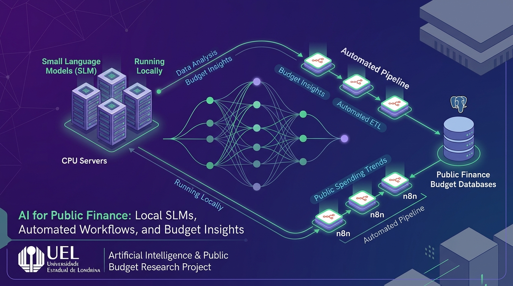
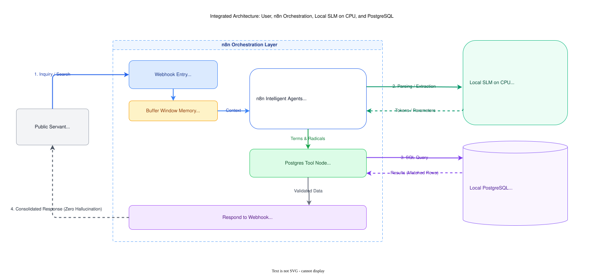

<div align="center">



# 🏛️ Public Budget Automation with Local SLMs & n8n
### Evaluation, Benchmarking, and Fine-Tuning of Small Language Models on CPU

[](https://www.uel.br/)
[](https://www.docker.com/)
[-000000?logo=ollama&logoColor=white)](https://ollama.ai/)
[](https://n8n.io/)
[-4169E1?logo=postgresql&logoColor=white)](https://www.postgresql.org/)
[](https://opensource.org/licenses/MIT)

</div>

---

## 📌 Project Overview

This applied research and university extension project, developed within the **Public Management Research Laboratory (LABGEP / NIGEP)** at the **State University of Londrina (UEL)**, aims to evaluate, benchmark, and fine-tune **Small Language Models (SLMs)** to serve as intelligent agents assisting public servants in preparing and adjusting the **Public Budget of the State of Paraná, Brazil**.

### Real-World Constraints & Engineering Challenges
1. **Strict CPU-Only Execution (Zero GPU Dependency)**: The target infrastructure consists of standard government workstations and legacy on-premise servers (e.g., Intel Xeon or standard desktop CPUs without dedicated AI accelerators). The inference pipeline must be lightweight and highly portable.
2. **Data Sovereignty & Fiscal Privacy**: Public fiscal data and internal budgetary proposals must remain strictly on-premise. No sensitive queries are routed to commercial proprietary cloud APIs.
3. **Zero Hallucination Tolerance ($H_{\text{rate}} = 0$)**: In public accounting (Brazilian Federal Law No. 4,320/1964 and State Budget Technical Manuals - MTO/PR), language models cannot invent non-existent budgetary actions, legal programs, or funding sources. The SLM is strictly responsible for intent recognition, canonical terminology normalization, and SQL search radical extraction, delegating deterministic verification to the database layer.

---

## 🏗️ System Architecture

The end-to-end architecture is structured into three decoupled layers:

<div align="center">



</div>

1. **Orchestration Layer (n8n)**:
   - Ingests public servant requests through Webhooks and Chat Triggers.
   - Manages conversational history using context-aware buffer memory (`Window Buffer Memory`).
   - Dispatches structured database lookup tools (`Postgres Tool`).
2. **Local CPU Inference Layer (Ollama / `llama.cpp`)**:
   - Executes quantized SLMs in 4-bit block formats (**GGUF Q4_K_M**), vectorized via **AVX** CPU instruction sets.
   - Categorizes incoming prompts (greetings, general accounting inquiries, or fiscal searches) and extracts singular, unaccented keywords and search stems (radicals).
3. **Fiscal Database Layer (PostgreSQL 16)**:
   - Stores official Paraná state budget registries: `acaoorcamentaria` (Budget Actions), `naturezadespesa` (Expense Categories), `fonte` (Funding Sources), `subfuncao` (Sub-functions), and budget amendment records (`dad`).
   - Performs fuzzy lexical matching using the **`pg_trgm`** (trigram similarity) and **`unaccent`** extensions.

---

## 📁 Repository Structure

```
.
├── testbench/                      # 🧪 Containerized testbench and benchmark suite
│   ├── docker-compose.yml          # Stack orchestration (Ollama, n8n, PostgreSQL)
│   ├── Makefile                    # Lifecycle automation (make up, make pull-models, etc.)
│   ├── sql/init.sql                # pg_trgm + unaccent extensions & official seed dataset
│   ├── scripts/setup_models.sh     # Automated download and verification of SLM candidates
│   ├── benchmark/                  # Python benchmark runner (TTFT, Throughput, Precision)
│   └── n8n_workflows/              # Pre-configured workflow for local Ollama & Postgres
├── n8n_production_workflows/       # 🔄 Reference workflows exported from active production (SEFA-PR)
├── docs/                           # 📄 Academic documentation and theoretical specifications
│   ├── assets/                     # Visual assets, banners, and architecture diagrams
│   ├── diagrams/                   # Editable Draw.io diagrams (.drawio)
│   ├── latex/                      # Full LaTeX academic paper source (main.tex, BibTeX, figures)
│   └── main.pdf                    # Compiled scientific paper (8 pages)
├── .gitignore                      # Git ignore specifications (context, .env, temporary files)
└── README.md                       # This document
```

---

## 🎯 Candidate SLM Matrix in Evaluation

We focus on compact and intermediate SLM models selected to run smoothly within an **8 GB RAM** envelope:

| Model | Parameters | Quantization (GGUF) | Benchmark Focus |
| :--- | :---: | :---: | :--- |
| **Llama 3.2** | 1B | ~1.3 GB | Minimal latency and smallest memory footprint |
| **Llama 3.2** | 3B | ~2.0 GB | Balanced trade-off between reasoning and CPU throughput |
| **Qwen 2.5** | 1.5B | ~1.0 GB | Superior instruction-following and Portuguese vocabulary |
| **Qwen 2.5** | 3B | ~1.9 GB | High accuracy in structured parameter and JSON extraction |
| **SmolLM2** | 1.7B | ~1.0 GB | Hugging Face academic baseline for compact models |

---

## 🚀 Quickstart: Running the Testbench (Home Lab / Local Server)

The test environment is fully containerized and can be launched on any Linux/Ubuntu server or local machine:

### 1. Launch the Stack
```bash
cd testbench
make up
```
*Creates the shared `lab-network` bridge and boots Ollama (port 11434), PostgreSQL (port 5432), and n8n (port 5678) with healthchecks.*

### 2. Download Recommended SLM Models
```bash
make pull-models
```

### 3. Run Automated Benchmarks
```bash
# Benchmark against default model (Llama 3.2 1B)
make test-direct

# Or test any other model in the matrix:
make test-direct MODEL=qwen2.5:1.5b
make test-direct MODEL=llama3.2:3b
```

The benchmark runner records **Time-To-First-Token (TTFT)**, **Throughput ($T_{\text{gen}}$ tokens/s)**, and **Radical Accuracy** in [`testbench/benchmark/benchmark_report.md`](testbench/benchmark/benchmark_report.md).

---

## 👥 Project Team & Academic Affiliation

- **Marcos Vinicius Beregula** — *Undergraduate in Data Science & Artificial Intelligence (UEL)* | [GitHub](https://github.com/MarcosDataScientist)
- **Guilherme Nascimento** — *Undergraduate in Data Science & Artificial Intelligence (UEL)*
- **Prof. Dr. Daniel Kaster** — *Associate Professor, Program Coordinator & Project Advisor (UEL)*

---

## 📜 License

This project is open-source and distributed under the [MIT](LICENSE) license.
Developed for academic, research, and public interest purposes at the **State University of Londrina (UEL)**.
